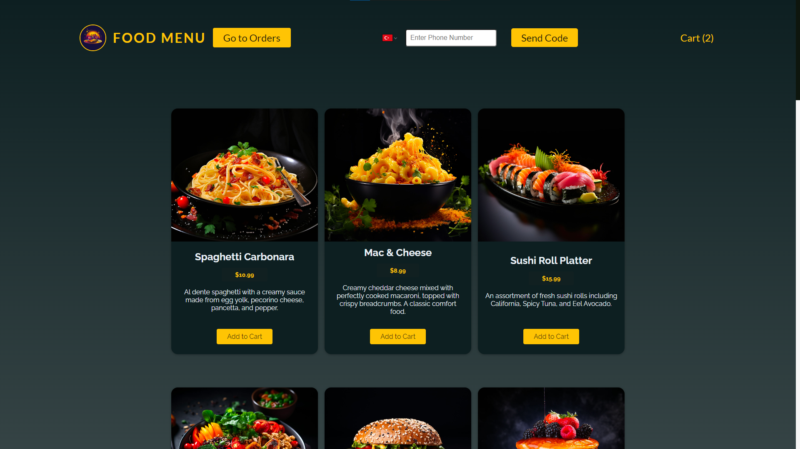

# Food Menu

A React app that allows users to browse and order meals from a restaurant with Authentication phone number via sms verification.

## Features

- Users can view a list of available meals with their prices and descriptions.
- Users can view a list of orders with information.
- Users can add or remove meals from their cart and see the total amount and number of items.
- Users can place an order by filling out a form with their table number.
- Employee can delete an order after its done.
- Employee can delete an order after its done.

## Installation

To run this project locally, you need to have Node.js and npm installed on your machine.

- Clone this repository using `git clone https://github.com/akifalbayrak/food-menu.git`
- Install the dependencies using `npm install`
- Start the development server using `npm run dev`

- Open `http://localhost:5173` in your browser to see the app
 

